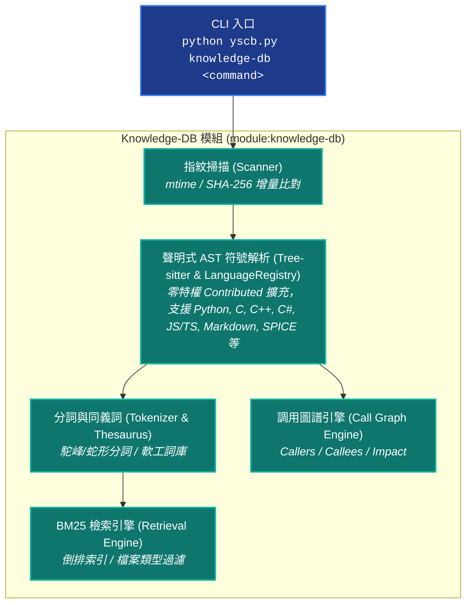

# YS-Codebase Knowledge-DB 知識庫與語意檢索模組 (Knowledge Database & Retrieval Engine)

> 模組名稱：`knowledge-db`  
> 職責定位：知識庫與符號檢索引擎。提供多語言 AST 符號解析、增量指紋比對、多欄位 BM25 檢索、調用圖譜分析 (Callers/Callees/Impact)、軟工同義詞庫與 AST 代碼切片預覽。

---

## 1. 模組架構全景 (Architecture Overview)

`knowledge-db` 模組提供代碼與文檔的解析、索引與多維檢索流水線：



---

## 2. 意圖導向三級複雜度矩陣 (3-Tier View Matrix)

本模組指令（`search`、`callers`、`callees`、`impact`）全面支援三級意圖複雜度與高密度 JSON 輸出：

| 複雜度層級 (Tier) | 觸發旗標 | 適用情境與終端輸出 | Agent 推薦 `--json` 格式 |
| :--- | :---: | :--- | :--- |
| **Tier 1: 極簡大綱 (Simple)**<br>*(預設模式)* | *(無旗標)*<br>`--simple` | 僅列出命中檔案、符號名稱、行號區間與分數，零代碼負擔。 | **超緊湊 JSON** (`--json`)：<br>Token 消耗 < 50 Tokens。 |
| **Tier 2: 內文瀏覽 (Preview)**<br>*(Agent 探索首選)* 🌟 | `-s` / `--snippet`<br>`--preview` | 一步到位取得帶行號之 AST 代碼切片、簽名與 Docstrings。 | **高密度業務 JSON** (`--json -s`)：<br>剪除雜湊 ID 與除錯欄位，資訊密度高達 86%+。 |
| **Tier 3: 全量除錯 (Detail)** | `-d` / `--detail`<br>`--verbose` | 包含 40 碼 SHA-1、BM25 分詞矩陣 (`matched_terms`) 與全量屬性。 | **全量除錯 JSON** (`--json -d`)：<br>保留全 Schema 與 2-space 縮排。 |

---

## 3. CLI 指令集速查與範例 (CLI Reference)

### 3.1 語意檢索與切片瀏覽 (`search`)

```bash
# 1. 極簡大綱檢索 (預設無 flag 即為 simple)
python yscb.py knowledge-db search 'ThesaurusEngine' --json

# 2. 內文切片檢索 (Agent 唯一首選 - 帶 AST 代碼切片)
python yscb.py knowledge-db search '編譯 佔位符 resolve' --json -s

# 3. 兩階段副檔名定向過濾
python yscb.py knowledge-db search 'SOP 0~7' --ftype=md --json -s          # 文檔脈絡
python yscb.py knowledge-db search 'resolve_uri' --ftype=c,cpp,py --json -s # 程式碼實作
```

### 3.2 調用圖譜與影響面分析 (`callers`, `callees`, `impact`)

```bash
# 1. 查詢誰調用了特定 Public API (Who calls me)
python yscb.py knowledge-db callers resolve_stage2_uri --json -s

# 2. 查詢特定類別或函式調用了哪些子組件 (Whom do I call)
python yscb.py knowledge-db callees compile_stage1 --json -s

# 3. 評估重構多階擴散影響半徑 (Blast Radius)
python yscb.py knowledge-db impact ReleasePublisher --depth=2 --json
```

### 3.3 知識庫狀態與維護管理 (`status`, `scan`, `bundle`, `index`, `clean`)

```bash
# 查詢全系統註冊空間、指紋快取與索引狀態
python yscb.py knowledge-db status

# 執行增量檔案指紋掃描
python yscb.py knowledge-db scan

# 建置或更新空間倒排索引快取
python yscb.py knowledge-db index

# 導出語意符號 SemanticBundle 發布包
python yscb.py knowledge-db bundle

# 清理指定空間或全空間快取檔案
python yscb.py knowledge-db clean --all
```

---

## 4. Python SDK 公開 API 速查 (Python SDK Reference)

```python
from knowledge_db.engine import KnowledgeEngine

# 初始化門面引擎 (自動感知已註冊空間與同義詞庫)
engine = KnowledgeEngine()

# 1. 多欄位 BM25 檢索
results = engine.search(
    query="ExecutionContext",
    limit=5,
    file_types=["py"],
    tier="snippet"  # "simple" | "snippet" | "detail"
)

# 2. 調用圖譜分析
callers = engine.callers("resolve_stage2_uri", tier="snippet")
callees = engine.callees("compile_stage1", tier="snippet")
impact = engine.impact("ReleasePublisher", max_depth=2)

# 3. 知識庫狀態與索引維護
status = engine.status()
diffs = engine.scan()
indices = engine.build_index()
```

---

## 5. 相關規範與技能手冊

- **探索規範指南**：[`.agents/skills/knowledge-db-search/SKILL.md`](../agents-workflow/assets/skills/knowledge-db-search/SKILL.md)
- **指令權限對照**：[`.agents/skills/yscb-cli-guild/SKILL.md`](../agents-workflow/assets/skills/yscb-cli-guild/SKILL.md)
